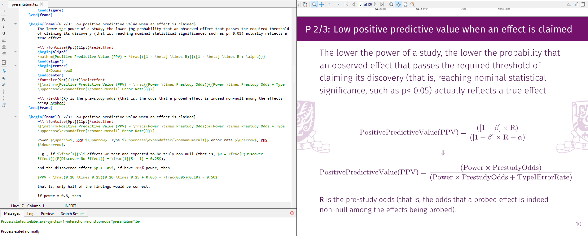

# beamerPreExample

It's a personal disclosure of using LaTeX to write PPT into PDF format. I chose the paper [Power failure: why small sample size undermines the reliability of neuroscience](https://www.nature.com/articles/nrn3475) because sample size estimation is one of my interested research areas. And I like the authors for publishing this paper because they may suffer great pressure of peer-review within this work. I think they are brave. I want their work has more exposure. 

This project is not a LaTeX tutorial. I'm not an expert in it. It's kind of my interest to use code to programm things and LaTeX happens to be my preferred tools to do academic writing. I never take CS lesson before and I'm pragmatist, so there can be codes that are not coded perfectly or the layout effect is not perfect. If you find it and know how to adjust it. Please contact me by quentinlampsy@gmail.com. I'm happy to learn from others.

## Environment
I used TeXStudio to do LaTeX coding. My TexStudio version is 4.7.3

Since I'm Chinese, I used XeLaTeX compiler in case I need to write Chinese in LaTeX. And I used Biber not BibTeX to compile bibliography.

The `presentation.bib` file is the bibliography source file. I used Zotero with [Better BibTex](https://github.com/retorquere/zotero-better-bibtex) plugin to manage references. I changed the citation key to `author in lower case + year` for shorter keys.

## Interface example

This is an example look of the programming interface. I personally really like the feelings of writing math fomula in LaTeX. It looks so good. I hope I can have more chances to write my fomula in my further research:) I hope you enjoy LaTeX, too!
